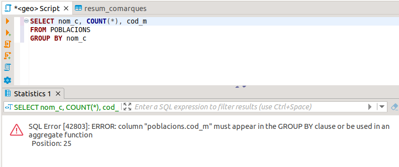

# 19\. Ordre amb què s'executa una sentència SQL

Com hem vist, i com veurem en la Part II d'aquest tema, la sentència
**SELECT** és molt completa i molt potent. Pot fer moltes coses.

Potser ens convinga saber en quin ordre s'executen les clàusules de què es
compon, perquè això ens pot prevenir de possibles errors en el moment de
construir una sentència d'una certa envergadura. L'ordre d'execució és el
següent:

  * Primer s'agafen les dades des de la taula o les taules especificades en el **FROM**. No podrem tractar informació que no tinguem en aquest origen de dades.
  * Després s'eliminen les files que no acompleixen la condició del **WHERE** , en cas que tinguem aquesta clàusula.
  * Després les files resultants s'agrupen pel o pels camps especificats en el **GROUP BY** , en cas que tinguem aquesta clàusula.
  * Una vegada fets els grups, s'eliminen els que no acomplesquen la condició del **HAVING** , en cas que tinguem aquesta clàusula.
  * Després se selecciona la informació especificada en les columnes, que en cas d'haver alguna funció d'agregat actuarà sobre els grups que resten (si teníem clàusula GROUP BY) o sobre el total de l'origen de dades.
  * Posteriorment s'ordena pels camps especificats en el **ORDER BY** , en cas que tinguem aquesta clàusula.
  * Després s'aplica els predicat **DISTINCT** en cas de tenir-lo especificat.
  * Per últim s'agafen tantes files com indica la clàusula **LIMIT** , desplaçades tantes com indique **OFFSET** , si és que tenim aquesta clàusula especificada..
  * Si tenim clàusula**INTO** es procedirà a crear una taula nova amb el resultat anterior.

Tenir clar aquest ordre ens pot clarificar alguna cosa, i poder evitar alguns
errors. L'error de la següent sentència ja s'havia explicat en la pregunta 13.
```
SELECT nom_c, COUNT(*), cod_m  
  FROM POBLACIONS  
  GROUP BY nom_c
```
> ens donarà el següent error:



> Però si analitzem l'ordre en què s'executen és lògic: quan arribem a mostrar
> els camps (entre ells **cod_m**) els grups ja s'han fet, i per a valors
> iguals de **nom_c**. En aquest moment no puc traure una cosa individual de
> cada grup com és el codi de municipi, perquè ja s'ha agrupat. En aquest
> moment només es pot intentar traure el nom de la comarca (ja que té el
> mateix valor per a tot el grup, és el camp pel qual hem agrupat), o alguna
> funció d'agregat, que calcula sobre el grup. I d'això ens intenta avisar
> PostgreSQL.

> Per a solucionar-lo podem incloure el **cod_m** en el **GROUP BY** , i
> aleshores farem un grup per cada comarca i població diferent, però
> segurament això no ens valdrà de res en aquest exemple, perquè cada grup
> només contindrà un element (un municipi), encara que en altres exemples sí
> que pot tenir sentit. O si no era això el que preteníem, senzillament llevem
> el camp cod_m de la sentència, i ens funcionarà bé.

Un altre exemple il·lustratiu (que ja el vam posar molt paregut en la pregunta
13) pot ser el següent: podríem intentar traure l'altura màxima de tots els
pobles, i la població que té aquesta altura. Podríem estar temptats de fer-lo
d'aquesta manera:
```
SELECT MAX(altura), nom  
  FROM POBLACIONS;
```
> Ens donarà el mateix error que abans, ja que com tenim una funció d'agregat
> intentarà fer grups, i com no tenim clàusula GROUP BY tota la taula serà un
> grup. I podrà calcular el màxim sense problemes, però no podrà traure una
> cosa individual del grup, com és el nom. I en aquest cas no es pot
> solucionar incloent el nom en el GROUP BY, perquè aleshores farem un grup
> per cada població. De moment, abans de veure les subconsultes, només podem
> resoldre aquest exemple ordenant per l'altura de forma descendent, i fer
> **LIMIT 1**.

Podem observar que si tenim clàusula **GROUP BY** , a partir d'aquest moment
tots els camps que posem han d'estar en el GROUP BY o en una funció d'agregat,
tant en la condició del **HAVING** , com en les **columnes** com en el **ORDER
BY**. En canvi no caldrà per a la clàusula **WHERE** , ja que aquesta es
realitza abans que el **GROUP BY**


Llicenciat sota la  [Llicència Creative Commons Reconeixement NoComercial
CompartirIgual 3.0](http://creativecommons.org/licenses/by-nc-sa/3.0/)

