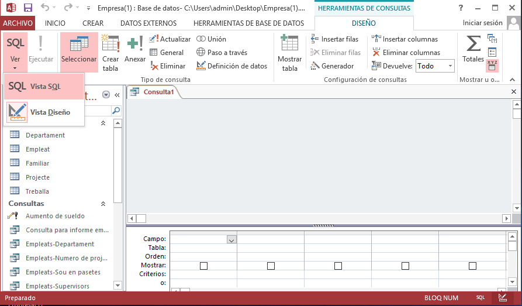
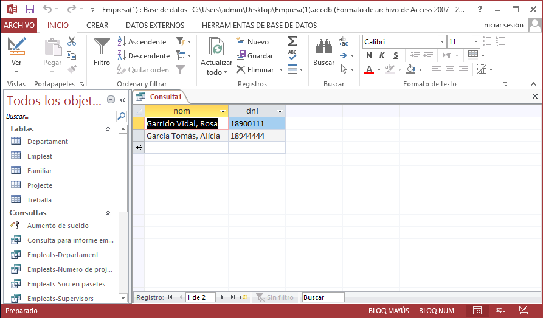

# 1\. Introducció

**SQL** és un llenguatge per a organitzar, gestionar i recuperar dades
emmagatzemades en una Base de Dades. El nom "**SQL**" és una abreviatura de
_**Structured Query Language**_ (Llenguatge Estructurat de Consultes), i com
el seu nom indica, és un llenguatge informàtic que es pot utilitzar per a
interaccions amb una Base de Dades de tipus relacional.

SQL s'utilitza per a controlar totes les funcions que un SGBD proporciona als
seus usuaris, incloent:

  * **_Definició de dades_**. SQL permet a un usuari definir l'estructura i organització de les dades emmagatzemades i les relacions existents entre elles (claus externes).

  * **_Recuperació de dades_**. SQL permet a un usuari o a un programa d'aplicació recuperar les dades emmagatzemades de la base de dades i utilitzar-les.

  * **_Manipulació de dades_**. SQL permet a un usuari o a un programa d'aplicació actualitzar la base de dades afegint noves dades, suprimint dades antigues i modificant dades prèviament emmagatzemades.

  * **_Control d'accés_**. SQL pot ser utilitzat per a restringir la capacitat d'un usuari per a recuperar, afegir i modificar dades, protegint així les dades guardades davant d'accessos no autoritzats.

  * **_Compartició de dades_**. SQL s'utilitza per a coordinar la compartició de dades per part d'usuaris concurrents, assegurant que no interfereixen entre ells.

  * **_Integritat de dades_**. SQL defineix restriccions d'integritat en la base de dades, protegint-la contra corrupcions causades per actualitzacions inconsistents o per fallades del sistema.

SQL no és realment un llenguatge informàtic complet tal com JAVA, C o Python.
SQL no disposa de la sentència _IF_ per a examinar condicions, ni de les
sentències _WHILE_ o _FOR_ per a fer bucles, per exemple. En compte d'això,
SQL és un subllenguatge de base de dades, que consta d'unes trenta sentències
especialitzades per a tasques de gestió de bases de dades, però **només 7 són
les sentències principals**.

També es diu que és un llenguatge de **quarta generació** perquè en ell es diu
quina informació es vol, sense especificar exactament com s'aconsegueix
aquesta informació.

També es diu que és un llenguatge orientat a **conjunt de registres** , ja que
una sentència pot tornar un conjunt de registres. Açò és un gran avantatge amb
els llenguatges de tercera generació, que només podien treballar registre a
registre.

Dues són les maneres d'executar sentències SQL.

  * **De forma interactiva** : s'escriu una sentència SQL, i s'executa, tornant normalment un conjunt de registres que es presentaran en forma tabular. En **Access** el lloc on procedir d'aquesta manera és en les **consultes** , triant _**Vista SQL**_. Tindrem lloc per escriure la sentència tal i com es mostra en la primera imatge. En la segona imatge, es mostra una consulta ja feta en el tema anterior, però veient-la en SQL. En la tercera hem executat la consulta:

 |  |   
---|---|---  
  
  * **Dins d'un programa** escrit en un altre llenguatge, que actuarà com llenguatge amfitrió (i el SQL seria el llenguatge host, "_huesped_ "). En el cas de Access podríem incloure sentències SQL en Visual Basic. D'aquesta manera s'estén el llenguatge amfitrió i li permet accedir a la Base de Dades.

SQL és el llenguatge estàndard d'accés i manipulació de Bases de Dades dels
Sistemes Gestors de Bases de Dades Relacionals. A tots, absolutament a tots
els SGBD Relacionales comercials es pot accedir per SQL.

## 2\. DDL i DML

Com s'ha comentat en la pregunta anterior, SQL ens permet definir, controlar i
accedir a una Base de Dades.

Farem una distinció principal entre aquestes funcions, separant el que són les
estructures de les taules i el contingut de les taules. En aquest sentit
tindrem 2 subtipus de llenguatges:

  * **DDL** (_Data Definition Language_ o _Llenguatge de Definició de Dades_): permet definir, modificar o esborrar les estructures, com poden ser taules, vistes, índex, ... i fins i tot Bases de Dades. Bàsicament les sentències són 3:   

  |    |    |     
---|---  
**CREATE** | per a crear l'estructura   
**ALTER** | per a modificar-la  
**DROP** | per a esborrar-la  

  * **DML** (_Data Manipulation Language_ o _Llenguatge de Manipulació de Dades_): permet accedir al contingut de les estructures, a les dades. Aquest accés pot ser de dos tipus: per a consultar o per a modificar les dades   
  
Per a consultar:  
**SELECT**  
  
Per a modificar  

  |    |    |     
---|---  
**INSERT** | insereix noves files  
**UPDATE** | modifica el contingut de files ja existents  
**DELETE** | esborra files  

El llenguatge SQL és més extens que les sentències anteriors, incorporant
també el que s'anomena **DCL** (_Data Control Language_ o _Llenguatge de
Control de Dades_), que permet controlar les dades per a donar permisos o
llevar-los sobre les dades, o controlar les transaccions, ..., però de moment
ens aconformarem amb les sentències de DML i DDL, i aquestes últimes,
sobretot, per a definir taules.

Llicenciat sota la  [Llicència Creative Commons Reconeixement NoComercial
CompartirIgual 3.0](http://creativecommons.org/licenses/by-nc-sa/3.0/)

