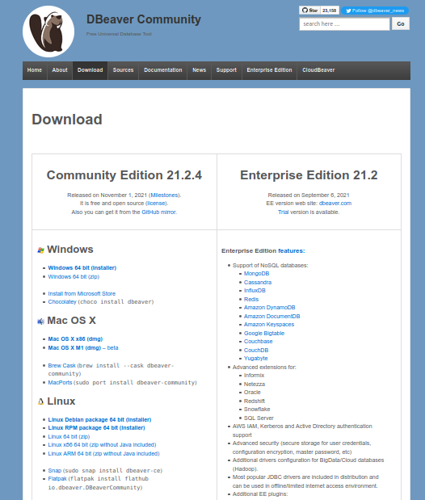
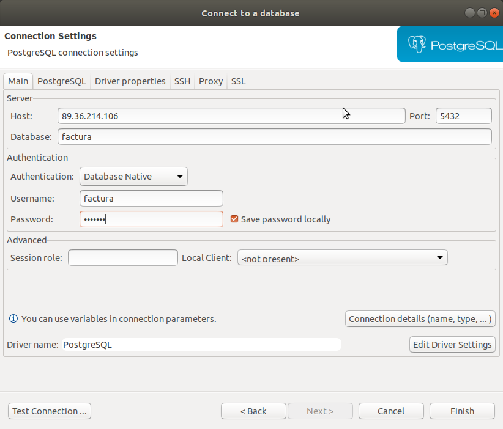
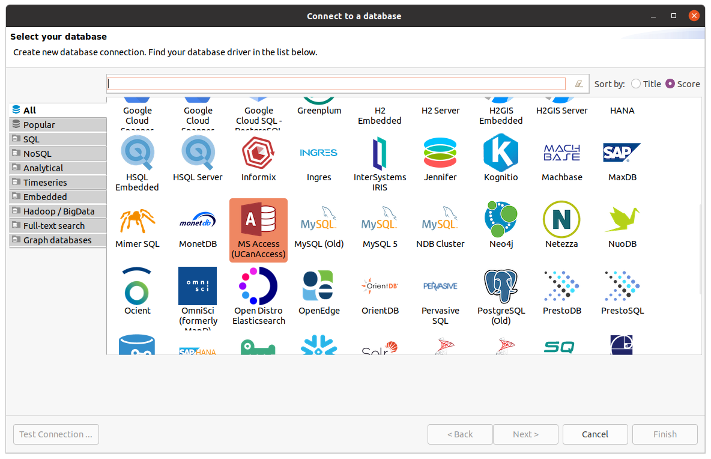
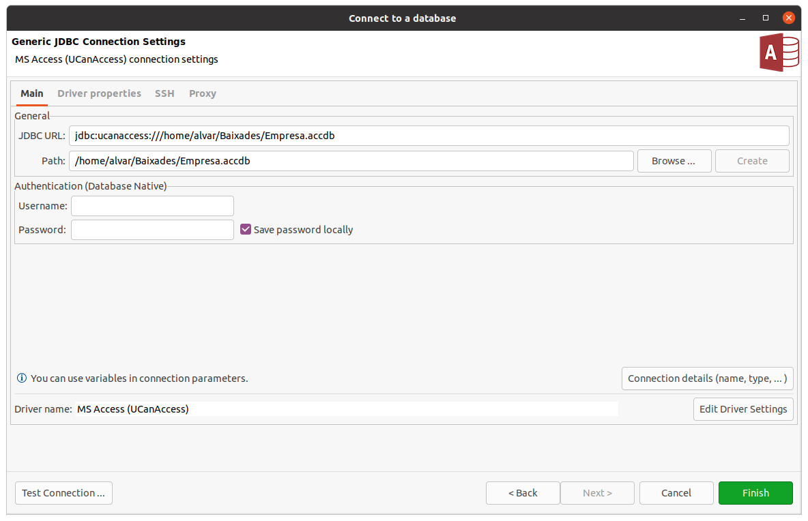
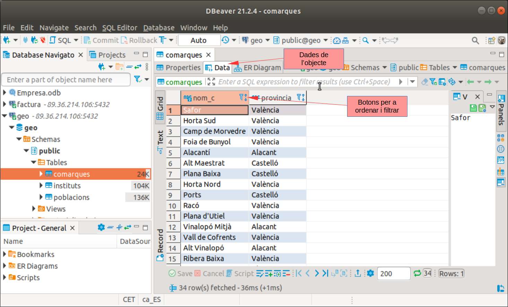

# 3\. Client DBeaver: instal·lació i confiuració

Com ja s'ha comentat, en aquest tema utilitzarem el Sistema Gestor de Bases de
Dades **PostgreSQL**. Aquest SGBD utilitza l'arquitectura **client-servidor**.
Això significa que hi ha un servidor central amb el PostgreSQL instal·lat, i
hi haurà molts clients que es connectaran a aquest servidor. Es pot fer des de
la mateixa màquina on està instal·lat el servidor, o des d'una altra.

En el nostre cas, el servidor ja està en marxa i funcionant. Podrem accedir a
ell tant des de dins de l'Institut com des de fora.

A nosaltres, per a poder connectar amb el servidor PostgreSQL ens fa falta el
**client de PostgreSQL**.

Instal·larem **DBeaver** , un programa que està pegant molt fort i ens permet
accedir a qualsevol Sistema Gestor de Bases de Dades molt còmodament.

En els ordinadors de l'Institut ja el tenim instal·lat. En casa us l'haureu
d'instal·lar però la seua instal·lació no ofereix cap problema.

Haureu d'anar a la pàgina de DBeaver, concretament a la de Downloads:
<https://dbeaver.io/download/>

Triarem la versió **Comunity Edition** , amb ella tindrem de sobres i és
totalment lliure. Com veieu es pot instal·lar sense problemes en Windows, Mac
i/o Linux

La versió Enterprise Edition també ens permetria accedir a moltíssimes Bases
de Dades NoSQL. Com veieu molt interessant.

Com hem dit amb la versió Comunity Edition tindrem més que suficient.

Tant en Linux com en Windows tenim la possibilitat de baixar-nos un fitxer
comprimit (zip o tar.gz respectivament) que només haurem de descomprimir i
buscar l'executable. També tenim la possibilitat de baixar-nos l'instal·lador,
que en Windows seria un executable i en Linux un paquet. Però la primera opció
del fitxer comprimit ens anirà bé.

La versió en el moment de fer aquestos apunts és la 21.2.4

Una vegada feta la instal·lació haurem de fer la connexió amb el SGBD que en
el nostre cas serà PostgreSQL. Però connectar a qualsevol altre SGBD seria
exactament igual.

La primera vegada que arranquem el programa, segurament ens demanarà per fer
la primera connexió. Arribarem a la mateixa finestra cada vegada que anem a
fer una nova connexió.

**<u>Primera connexió a PostgreSQL: geo</u>**

Especificarem que volem connectar a PostgreSQL i a continuació donarem les
dades de connexió, que són aquestes:

  * Servidor (**Host**): **89.36.214.106**
  * Base de Dades (**Database**): **geo**
  * Usuari (**Username**): **geo**
  * Contrasenya (**Password**): **geo**

En aquesta Base de Dades tindrem unes taules que ens serviran per a fer els
exercicis de SQL. Comentarem la seua estructura més endavant.

Aquestes són les finestres on especificaríem l'anterior:

 |   
---|---  
  
**<u>Segona connexió a PostgreSQL: factura</u>**

Per als exercicis treballarem sobre una altra Base de Dades més completa que
ens done més joc a l'hora de fer les sentències SQL. La Base de Dades
s'anomena factura, i s'ha de connectar amb l'usuari factura amb contrasenya
factura. Comentarem la seua estructura més endavant. Aquestes són les dades de
connexió:

  * Servidor (**Host**): **89.36.214.106**
  * Base de Dades (**Database**): **factura**
  * Usuari (**Username**): **factura**
  * Contrasenya (**Password**): **factura**

Aquestes són les pantalles on faríem la connexió:

 |   
---|---  
  
**<u>Exemple de connexió a Access: Empresa.accdb</u>**

Únicament a mode il·lustratiu anem a mostrar una altra connexió diferent a les
de PostgreSQL. Com que de moment només havíem treballat amb **Access** , anem
a intentar connectar amb la Base de Dades **Empresa.accdb** feta en el tema
anterior.

La connexió l'haurem de fer a **MS Access (UCanAccess)**. Després només haurem
de navegar per trobar la Base de Dades **Empresa.accdb**

Ací presentem les pantalles per a fer la connexió:

 |   
---|---  
  
 ## 4\. Client DBeaver: utilització

Una vegada feta la connexió, **DBeaver** ens permetrà navegar per les taules i
altres objectes de la Base de Dades, inspeccionar les taules, i el més
important per a nosaltres, executar sentències SQL de forma còmoda.

En la següent imatge es presenten algunes de les seues parts i
caracteristiques. En ella s'ha fet doble clic sobre una taula, COMARQUES, per
veure les seues característiques:

També podem veure les dades, i fins i tot afegir noves files, esborrar o
modificar les existents. Es pot ordenar les files i fer filtres:

I també tindrem la possibilitat d'executar consultes SQL (en la primera imatge
es mostra com arribar). En la finestra de sentències SQL podrem editar la
consulta de forma còmoda (ens dóna molta ajuda per a no cometre errors
sintàctics) i també ens mostra el resultat. Podem modificar quantes vegades
vulguem. i des del menu **File** podrem guardar la consulta, cosa que farem
per a tots els exercicis del tema:

 

Llicenciat sota la  [Llicència Creative Commons Reconeixement NoComercial
CompartirIgual 3.0](http://creativecommons.org/licenses/by-nc-sa/3.0/)

