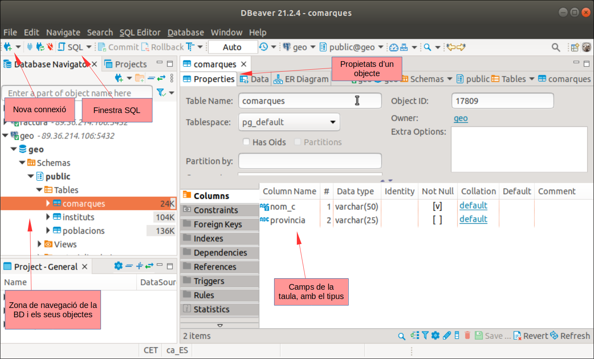
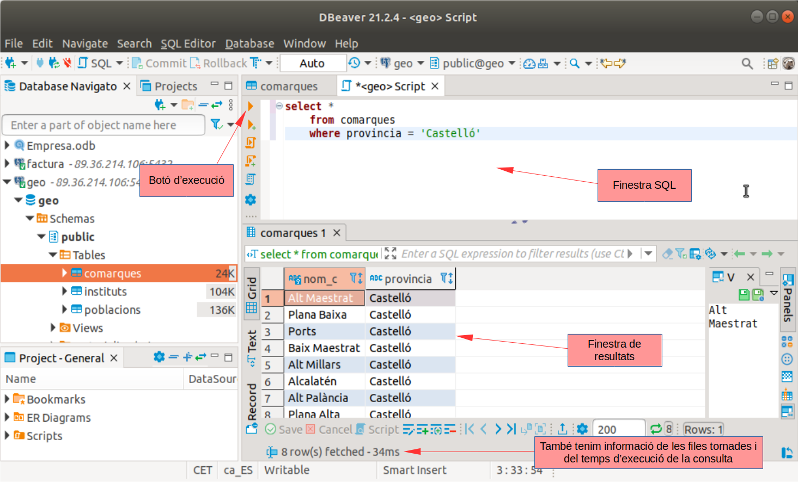

# 4. Client DBeaver: utilització

Una vegada feta la connexió, **DBeaver** ens permetrà navegar per les taules i
altres objectes de la Base de Dades, inspeccionar les taules, i el més
important per a nosaltres, executar sentències SQL de forma còmoda.

En la següent imatge es presenten algunes de les seues parts i
caracteristiques. En ella s'ha fet doble clic sobre una taula, COMARQUES, per
veure les seues característiques:

També podem veure les dades, i fins i tot afegir noves files, esborrar o
modificar les existents. Es pot ordenar les files i fer filtres:

I també tindrem la possibilitat d'executar consultes SQL (en la primera imatge
es mostra com arribar). En la finestra de sentències SQL podrem editar la
consulta de forma còmoda (ens dóna molta ajuda per a no cometre errors
sintàctics) i també ens mostra el resultat. Podem modificar quantes vegades
vulguem. i des del menu **File** podrem guardar la consulta, cosa que farem
per a tots els exercicis del tema:

Llicenciat sota la  [Llicència Creative Commons Reconeixement NoComercial
CompartirIgual 3.0](http://creativecommons.org/licenses/by-nc-sa/3.0/)

