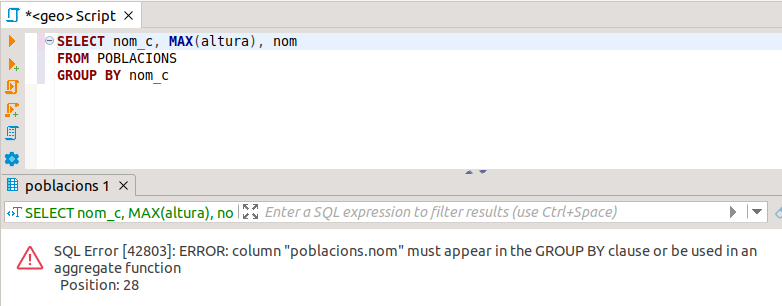

# 6. La clàusula GROUP BY

Agrupa totes les files amb valors iguals d'una o d'unes columnes

**<u>Sintaxi</u>**
```
SELECT <columnes>  
  FROM <taules>  
  GROUP BY <columnes>
```
Per cada fila amb valors iguals de les columnes de la clàusula **GROUP BY** ,
en trau només una, és a dir, les agrupa.

Les _**funcions d'agregat**_ agafen tot el seu sentit i potència combinades
amb el **GROUP BY** : tornaran un valor per cada grup. Així, per exemple,
aquesta sentència traurà quantes poblacions hi ha en cada comarca:
```
SELECT COUNT(*)  
  FROM POBLACIONS  
  GROUP BY nom_c
```
> Si volem excloure files per a que no entren en les agrupacions, ho farem per
> mig de la clàusula **WHERE**. En aquest exemple ens aprofitem del codi de
> municipi, que en el cas dels municipis de la província de Castelló és 12000
> i pico.
```
SELECT COUNT(*)  
  FROM POBLACIONS  
  WHERE cod_m >= 12000 and cod_m < 13000  
  GROUP BY nom_c
```
Quan tenim agrupacions de files, bé perquè utilitzem la clàusula GROUP BY, bé
perquè entre les columnes que es trien en el SELECT hi ha alguna funció
d'agregat, o les dues coses a l'hora, es poden cometre errors amb una relativa
facilitat. Quan hi ha una agrupació **totes les columnes que seleccionem amb
el SELECT hauran d'estar en el GROUP BY, o bé estar dins d'una funció
d'agregat**. En cas contrari ens donarà error. Per exemple, aquesta consulta
funciona bé, i de fet és millor consulta que les d'abans, ja que ens diu la
comarca i el numero de pobles que té cadascuna:
```
SELECT nom_c, COUNT(*)  
  FROM POBLACIONS  
  GROUP BY nom_c
```
Però aquesta no:
```
SELECT nom_c, COUNT(*), cod_m  
  FROM POBLACIONS  
  GROUP BY nom_c
```
És sintàcticament incorrecta, i a banda no té sentit: si agrupem tots els
pobles de la mateixa comarca ¿com hem de poder traure després el codi del
municipi de cada poble?.

Com és relativament fàcil cometre aquest error, haurem d'identificar aquest
error, per a poder solucionar-lo.

Per exemple, aquesta consulta ens dóna la població més alta de cada comarca:
```
SELECT nom_c, MAX(altura)  
  FROM POBLACIONS  
  GROUP BY nom_c
```
Però si intentàrem traure també el nom de la població més alta de cada
comarca:
```
SELECT nom_c, MAX(altura), nom  
  FROM POBLACIONS  
  GROUP BY nom_c
```
ens donaria el següent error:



Hem d'aprendre a identificar aquest error, i solucionar-lo. En aquest cas el
solucionarem llevant el camp **Nom**. La sentència per a poder traure el nom
de la població més alta de cada comarca és complicada, i encara no podem fer-
la.

**<u>Exemples</u>**

  1) Comptar el nombre d'instituts de cada població.
```
SELECT cod_m, COUNT(*)  
  FROM INSTITUTS  
  GROUP BY cod_m
```
  2) Comptar el nombre de comarques de cada província.
```
SELECT provincia, COUNT(*)  
  FROM COMARQUES  
  GROUP BY provincia
```
  3) Calcular l'altura màxima, mínima i l'altura mitjana de cada comarca.
```
SELECT nom_c, MAX(altura), MIN(altura), AVG(altura)  
  FROM POBLACIONS  
  GROUP BY nom_c
```
  4) Comptar el nombre d'instituts de cada població i cada codi postal.
```
SELECT cod_m, codpostal, COUNT(*)  
  FROM INSTITUTS  
  GROUP BY cod_m, codpostal
```

## :pencil2: Exercicis

**Ex_21** Comptar el número de pobles de cada província (és suficient traure el
codi de la província i el número de pobles).

**Ex_22** Comptar el nombre de clients en cada poble i codi postal.

**Ex_23** Comptar el número de factures de cada venedor a cada client.

**Ex_24** Comptar el número de factures de cada trimestre. Per a poder traure
el trimestre i agrupar per ell (ens val el número de trimestre, que va del 1
al 4), podem utilitzar la funció **TO_CHAR(data,'Q')**.

**Ex_25** Calcular quantes vegades s'ha venut un article, la suma d'unitats
venudes, la quantitat màxima i la quantitat mínima.

**Ex_26** Comptar el número d'articles de cada categoria i el preu mitjà.

**Ex_27** Calcular el total de cada factura, sense aplicar descomptes ni IVA.
Només ens farà falta la taula **LINIES_FAC** , i consistirà en agrupar per
cada **num_f** per a calcular la suma del **preu** multiplicat per la
**quantitat**.

Llicenciat sota la  [Llicència Creative Commons Reconeixement NoComercial
CompartirIgual 3.0](http://creativecommons.org/licenses/by-nc-sa/3.0/)

