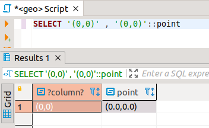

# 4.1 Operadors

Els operadors que es gasten en el SQL de PostgreSQL són moltíssims. Cada tipus
de dades té una sèrie d'operadors, i el mateix operador, aplicat a tipus
distints pot fer coses diferents.

Es poden veure tots els operadors en la taula **PG_OPERATOR** , on tindrem el
nom de l'operador, els tipus de dades dels operands i del resultat i el
procediment que implementa l'operador. Ací tenim una vista d'aquesta taula,
encara que hi ha tantíssims operadors que mareja i tot (els que estan repetits
és per a especificar l'actuació sobre operands de diferents tipus).


Podríem fins i tot definir els nostres operadors, amb la sentència **CREATE
OPERATOR** , on definiríem el tipus de l'operador de l'esquerra, el de la
dreta, la funció que implementa l'operador, ... Ho intentarem en el tema
següent, quan ja sapiguem crear funcions.

No farem un repàs extens de tots els operadors. Només els més habituals, i
algun d'un tipus de dades especial. Els tipus de dades els veurem en la
tercera part d'aquest tema, quan les sentències de creació de taules.

Per tant, fixeu-vos sobretot en els opradors **aritmètics** , de **cadena** i
de **comparació**.

**Operadors aritmètics**{.azul}


+ |  Suma |  - |  Resta |  * |  Multiplicació |  / |Divisió  
---|---|---|---|---|---|---|---
^ |  Exponenciació |  \|/ |  Arrel quadrada |  ! |  Factorial |  % |  Mòdul (rest de la divisió)  
  
**<u>Exemples</u>**
```
SELECT |/16;

SELECT 5 ^ 3;

SELECT 5!;
```

**Operadors de cadena**{.azul}

\|\| |  Concatenació  
---|---  
  
**<u>Exemples</u>**
```
SELECT 'Data i hora actual: ' || Now();
```

**Operadors de comparació**{.azul}

= |  Igual | < > | Distint | != |  Distint | | |
---|---|---|---|---|---|---|---
\> |  Major |  > = |  Major o igual |  < |  Menor |  < = |  Menor o igual

  
S'utilitzen principalment en les condicions. Tornen sempre un valor booleà
(true o false)


**Operadors conversor de tipus**{.azul}

```
::tipus
```

Servirà per a convertir alguna dada a algun tipus de dades.

Així, per exemple,

  * **'25-4-2012'::date** estem convertint una cadena de text en una dada de tipus date.
  * **'(0,0)'::point** estem convertint el text a un punt.

La forma utilitzada en els exemples anteriors és una forma molt habitual de
posar les constants d'un determinat tipus: la posem com a cadena de caràcters
(entre cometes) i després la convertim. L'única restricció serà que PostgreSQL
"entenga" el que hi ha entre cometes per fer la conversió.

Per veure que realment hi ha un canvi ens aprofitem de DBeaver que diu de quin
tipus és un camp, si pot. Observeu que en el primer camp no hem posat més que
una tira de caràcters, però en el segon intentem reconvertir aquesta mateixa
tira de caràcters al tipus POINT. En el resultat s'observa com ha entés que el
tipus de la dada és POINT.



També ens serviria la funció **point ('(0,0)')**

**<u>Operadors Geomètrics</u>**

**Operador** |  **Descripció** |  **Utilització**  
---|---|---  
<-> |  Distància (han de ser del mateix tipus) |  point '(1,0)' <-> point '(3,0)'  
<@ |  Està contingut en? |  '(1,1)'::point @ '((0,0),(2,2))'::box  
@> |  Conté? |  box '((0,0),(2,2))' @> point '(1,1)'  
  
La llista d'operadors és molt més llarga, però ací només volem mostrar-ne
algun a mode il·lustratiu.

Podem fer comprovacions d'aquest tipus:
```
SELECT '(0,0)'::point <-> '(3,4)'::point;
```
que ens donarà la **distància** entre el punt **(0,0)** i el punt **(3,4)**.
Aquesta distància ha de ser 5.
```
SELECT '(1,1)'::point <@ '((0,0),2)'::circle;
```
que ens dirà si el **punt** **(1,1)** està **dins** del **cercle amb origen
(0,0) i radi 2**. Com que sí que està tornarà el valor **true** (vertader).


Llicenciat sota la  [Llicència Creative Commons Reconeixement NoComercial
CompartirIgual 3.0](http://creativecommons.org/licenses/by-nc-sa/3.0/)

