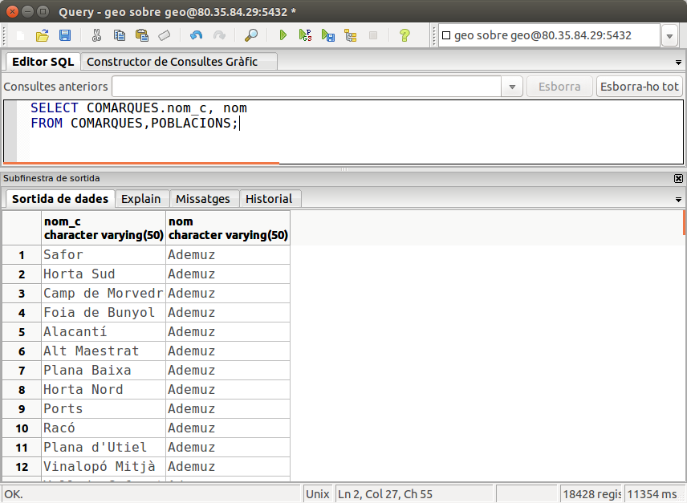
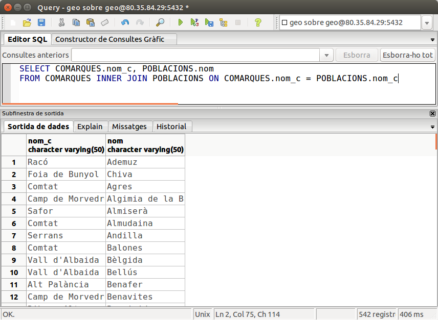
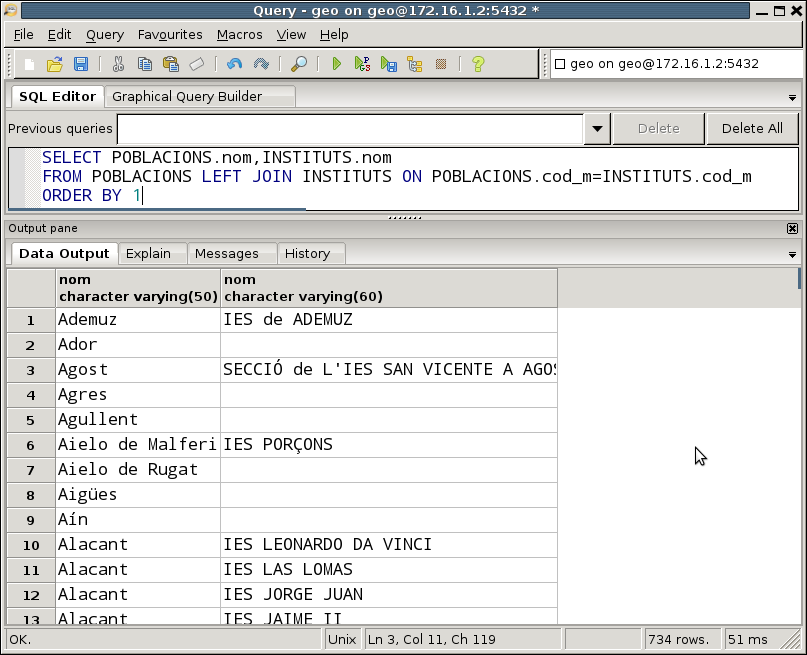
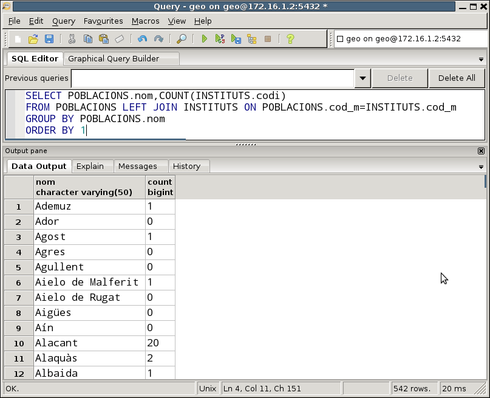
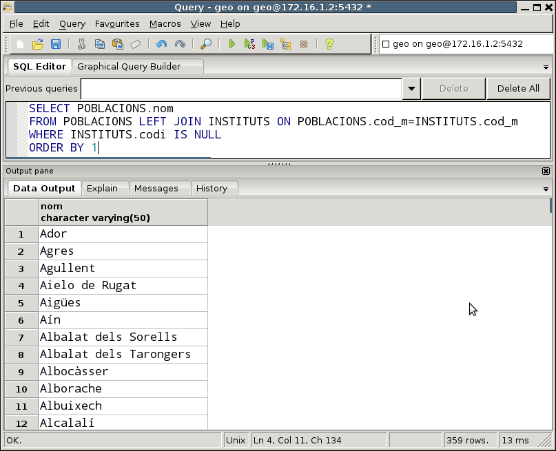

# 2 Combinacions de taules

Vam veure en la sentència bàsica que en la clàusula FROM posàvem la taula **o
taules** d'on s'agafarien les dades, però en tots els exemples posteriors
només entrava en joc una única taula.

És el moment d'estudiar les diferents possibilitats que tindrem quan posem més
d'una taula.

  * La primera és el **producte cartesià** , que no utilitzarem mai, però hem de saber en què consisteix per poder evitar-lo.
  

  * La segona serà la més utiilitzada, la **combinació**(que de vegades anomenarem **reunió**).
  

  * La tercera és una variant de l'anterior, la **combinació externa** , molt útil en alguns casos.

## 2.1 Producte cartesià

La manera més senzilla és posar les taules separades per comes, però
segurament el resultat no és el que esperàvem.

Per exemple podem fer la següent sentència:

```
  SELECT COMARQUES.nom_c, nom  
    FROM COMARQUES,POBLACIONS;
```


!!! note "Nota"
    Observeu que hem posat el nom de la taula davant del camp <b>nom_c</b> , perquè
    les dues taules tenen un camp amb aquest nom. Aquesta operació s'anomena
    <b>qualificació</b>. Si no qualificàrem amb el nom de la taula davant, hi
    hauria ambigüitat, no sabria a quin camp es refereix, si el d'una taula o el
    de l'altra. Quan els noms dels camps són diferents i per tant no
    coincideixen en les dues taules, no cal qualificar el camp (com per exemple
    amb el camp <b>nom</b>)


Si executem la sentència, veurem que tindrem un nombre de files inesperadament
alt, **18.428 files !!!** I si analitzem les files veurem el perquè: s'ha
combinat cada comarca amb tots els pobles (siguen de la comarca o no).



Aquesta operació s'anomena **PRODUCTE CARTESIÀ**(_**cross join**_), i es
caracteritza en què cadascuna de les files d'una taula es combina amb totes
les files de l'altra taula. El nombre de files resultant serà, doncs, el
resultat de multiplicar el nombre de files d'una taula pel nombre de files de
l'altra taula (en el nostre cas 34 x 542 = 18428).

Rarament voldrem fer un producte cartesià. El més normal serà combinar una
miqueta millor les taules. En el nostre exemple segurament ens interessarà
molt més combinar _cada comarca amb les seues poblacions_.

## 2.2 Combinació interna


**Combinació de dues taules: Sintaxi**{.azul}

Normalment el producte cartesià no ens interessarà. Més bé voldrem combinar
les taules de manera que dos camps, un camp de cada taula, coincidesquen. I el
més habitual, si tenim la Base de Dades ben dissenyada, serà que els camps
coincidents siguen una clau externa amb la clau principal a la qual apunta.
Així, en l'exemple que utilitzàvem en el punt anterior, el que sí que ens serà
útil és combinar cada comarca amb les seues poblacions. I justament tenim un
camp en la taula POBLACIONS, **nom_c** , que és clau externa i apunta a la
clau principal de **COMARQUES**.

Aquesta operació l'anomenarem **COMBINACIÓ INTERNA** o senzillament
**COMBINACIÓ** , i de vegades també es diu **REUNIÓ**. La seua sintaxi és la
següent:
```
  SELECT ...  
    FROM taula1 INNER JOIN taula2 ON _condició_
```
La condició de la reunió consistirà en comparar un camp de cada taula.
Els dos camps hauran de ser del mateix tipus, però no caldrà que tinguen el
mateix nom. Les files que eixiran al resultat seran les que acompliran la
condició.

Encara que els operadors que es poden utilitzar són tots els de comparació, en
la pràctica SEMPRE utilitzarem el d'igualar. Per tant podem refinar millor la
combinació de 2 taules
```
  SELECT ...  
    FROM taula1 INNER JOIN taula2 ON taula1.camp1 = taula2.camp2
```
L'exemple de les comarques i les seues poblacions quedarà així
```
  SELECT COMARQUES.nom_c, POBLACIONS.nom  
    FROM COMARQUES INNER JOIN POBLACIONS ON COMARQUES.nom_c = POBLACIONS.nom_c
```
I aquest seria el resultat



que com veiem torna 542 files (tantes com pobles)

Alternativament, podríem posar la mateixa reunió d'una altra forma:
```
  SELECT COMARQUES.nom_c, POBLACIONS.nom  
    FROM COMARQUES,POBLACIONS  
    WHERE COMARQUES.nom_c = POBLACIONS.nom_c
```
on estrictament el que estem fent és, del producte cartesià de les 2 taules,
seleccionar únicament quan coincideix el **nom_c** (és a dir la comarca amb
les seues poblacions), i per tant el resultat seria el mateix. Potser fóra més
eficient utilitzar la primera manera, però de vegades la comoditat ens farà
utilitzar la segona (sobretot quan s'hagen de combinar moltes taules).

Les dues maneres de posar la conbinació de dues taules són les més habituals,
i que funcionen en qualsevol Sistema Gestor de Bases de Dades.

Tanmateix en PostgreSQL (i en altres SGBD com Oracle) hi ha més maneres de fer
una combinació. No les veurem tan a fons perquè les anteriors ens basten i
sobren:

  * **INNER JOIN amb USING** : En el cas que els camps a reunir de les dues taules es diguen exactament igual, podem substituir la condició posada en **ON** per l'expressió **USING** , amb el camp de la reunió entre parèntesis
```
  SELECT COMARQUES.nom_c, POBLACIONS.nom  
    FROM COMARQUES INNER JOIN POBLACIONS USING (nom_c)
```
  * **NATURAL JOIN** : També per al cas anterior, en què el camp en les dues taules es diu igual, podem fer-lo de forma encara més abreviada. Farà una reunió, igualant tots els camps que es diguen igual de les dues taules. Hem d'anar en compte, per si de cas hi ha algun altre camp en les dues taules que es diga igual.
```
  SELECT COMARQUES.nom_c, POBLACIONS.nom  
    FROM COMARQUES NATURAL JOIN POBLACIONS
```
**<u>Exemples</u>**

  1) **Traure el noms de les Poblacions i els noms dels Instituts que hi ha en elles.**

Haurem de combinar les taules per la clau externa d'INSTITUTS a POBLACIONS (és
a dir la que apunta de cod_m en INSTITUTS fins a la clau principal de
COMARQUES, que és justament cod_m).
```
  SELECT POBLACIONS.nom,INSTITUTS.nom  
    FROM POBLACIONS INNER JOIN INSTITUTS ON POBLACIONS.cod_m=INSTITUTS.cod_m;
```
Utilitzant l'altra sintaxi, que posem la condició en el **WHERE** , ens
quedaria:
```
  SELECT POBLACIONS.nom,INSTITUTS.nom  
    FROM POBLACIONS , INSTITUTS  
    WHERE POBLACIONS.cod_m=INSTITUTS.cod_m;
```
Com en aquest cas el camp que hem d'igualar té el mateix nom en les dues
taules, utilitzant la sintaxi del **USING** ens quedari més fàcil:
```
  SELECT POBLACIONS.nom,INSTITUTS.nom  
    FROM POBLACIONS INNER JOIN INSTITUTS USING(cod_m);
```
En canvi, hem d'anar amb molt de compte amb la sintaxi del **NATURAL JOIN** ,
perquè itentarà igualar tots els camps que es diuen igual, i en aquest cas
tenim dos camps coincidents: cod_m i nom. cod_m és el que volem, però nom ens
fastidiarà, i evidentment no coincideix mai el nom de l'Institut i el de la
població, i per tant no tornarà cap fila.
```
  SELECT POBLACIONS.nom,INSTITUTS.nom  
    FROM POBLACIONS NATURAL JOIN INSTITUTS;
```
  2) **Traure els noms de les comarques i la província, amb el nombre de poblacions que té cada comarca.**

Ens fan falta dues taules, COMARQUES per a poder traure el nom de la comarca i
la província, i POBLACIONS per a poder comptar els pobles de cada comarca. Les
haurem de combinar, agrupar per comarca (i província també, perquè volem que
aparega el nom de la província) i comptar les poblacions. A l'hora de comptar
podem comptar files (COUNT(*)), però potser siga millor comptar algun camp de
la taula POBLACIONS, per exemple cod_m, que és la clau principal (recordem que
els valors nuls no es comptaran, i cod_m per ser clau principal no pot ser
nul).
```
  SELECT COMARQUES.nom_c, provincia, COUNT(cod_m) AS Quants  
    FROM COMARQUES INNER JOIN POBLACIONS ON COMARQUES.nom_c=POBLACIONS.nom_c  
    GROUP BY COMARQUES.nom_c, provincia;
```
 **Tres o més taules**{.azul}

Si tenim més de 2 taules, haurem de procedir de la mateixa manera, ja que si
deixem de combinar alguna taula, tindrem el producte cartesià. Com en la
immensa majoria de casos, la reunió la farem per les claus externes que tenim
definides. Únicament haurem de cuidar els parèntesis, per a marcar primer una
condició de combinació i després l'altra. En un exemple ho veurem perfectament
il·lustrat.

Intentem traure el nom d'una comarca i la província, el nom dels seus pobles i
el nom dels instituts d'aquestos pobles. Ens fan falta les taules COMARQUES
(pera poder traure el nom de la comarca i província), POBLACIONS (per a traure
el nom de la població) i INSTITUTS (per al nom d'aquestos). Ordenarem per nom
de comarca, i dins d'aquest per població, per a una millor lectura del
resultat
```
  SELECT COMARQUES.nom_c, provincia, POBLACIONS.nom, INSTITUTS.nom  
    FROM (COMARQUES INNER JOIN POBLACIONS ON COMARQUES.nom_c=POBLACIONS.nom_c)  
    INNER JOIN INSTITUTS ON POBLACIONS.cod_m=INSTITUTS.cod_m  
    ORDER BY 1,3;
```
Podríem posar la consulta de la forma alternativa, en què les condicions de
reunió van en el WHERE. Òbviament aquestes condicions han d'anar unides per
l'operador AND.
```
  SELECT COMARQUES.nom_c, provincia, POBLACIONS.nom, INSTITUTS.nom  
    FROM COMARQUES , POBLACIONS , INSTITUTS  
    WHERE COMARQUES.nom_c=POBLACIONS.nom_c AND POBLACIONS.cod_m=INSTITUTS.cod_m  
    ORDER BY 1,3;
```
Anem a plantejar un altre exemple. Es tracta de traure el nom i la província
de les comarques, amb el número d'Instituts que hi ha en elles. En principi
podríem pensar que les úniques taules que ens fan falta són COMARQUES (per a
traure el nom i província de la comarca) i INSTITUTS (per a poder comptar els
INSTITUTS). Si intentem fer aquesta consulta, **NO** obtindrem el resultat
desitjat.


!!! warning "Aviso"
    **SELECT nom_c, provincia, COUNT(codi)**{.rojo}  
    **FROM COMARQUES , INSTITUTS)**{.rojo}  
    **GROUP BY nom_c, provincia)**{.rojo}  


Evidentment hi haurà un producte cartesià, ja que no hem combinat les taules,
i ens eixirà per a cada comarca 375 instituts, que és el número total
d'instituts, ja que s'ha combinat cada comarca amb tots els instituts.

Però aleshores, per quin camp combinem? Si intentem unir les claus principals,
**nom_c** amb **codi** (el codi d'Institut) no poden combinar bé per raons
evidents. Ens hem de fixar en el disseny de la Base de Dades. Observarem que
el problema és que no hi ha una clau externa entre INSTITUTS i COMARQUES. Però
també ens dóna la solució: **haurem de posar també la taula POBLACIONS**
encara que no vulguem visualitzar cap camp d'aquesta taula, ja que si estan
relacionades les taules INSTITUTS i COMARQUES és a través d'aquesta taula. Per
tant la consulta correcta serà:
```
  SELECT COMARQUES.nom_c, provincia, COUNT(codi)  
    FROM (COMARQUES INNER JOIN POBLACIONS ON COMARQUES.nom_c=POBLACIONS.nom_c)  
    INNER JOIN INSTITUTS ON POBLACIONS.cod_m=INSTITUTS.cod_m  
    GROUP BY COMARQUES.nom_c, provincia
```
La forma alternativa sembla més curta. Està clar que si són 3 taules, hauran
d'haver 2 condicions de combinació unides per AND.
```
  SELECT COMARQUES.nom_c, provincia, COUNT(codi)  
    FROM COMARQUES , POBLACIONS , INSTITUTS  
    WHERE COMARQUES.nom_c=POBLACIONS.nom_c AND POBLACIONS.cod_m=INSTITUTS.cod_m  
    GROUP BY COMARQUES.nom_c, provincia;
```
De forma general, si tenim _**n**_ taules en una consulta, ens faran falta
_**n-1**_ condicions de combinació unides per AND. Per exemple, si en una
consulta entren 5 taules, per a no tenir cap producte cartesià ens faran falta
4 condicions unides per AND.

**Una taula més d'una vegada**{.azul}

Anem a plantejar un altre exemple interessant: traure el nom de les
poblacions, amb el nom de la capital de comarca. Lamentablement amb les dades
que tenim en la Base de Dades d'exemple no podrem provar-lo, així que anem a
fer una suposició, una Base de Dades lleugerament modificada per a il·lustrar
aquest exemple.

Suposem que la nostra taula de POBLACIONS fóra lleugerament diferent, i que
incorporara un camp nou amb el codi del municipi que és capital de comarca de
la població:
```
  POBLACIONS  
  (  
  cod_m numeric(5,0) CONSTRAINT cp_pobl PRIMARY KEY,  
  nom character varying(50) NOT NULL,  
  poblacio numeric(6,0),  
  extensio numeric(6,2),  
  altura numeric(4,0),  
  longitud character varying(50),  
  latitud character varying(50),  
  llengua character(1),  
  nom_c character varying(50),  
  ***cod_capital numeric(5,0) CONSTRAINT ce_capital REFERENCES POBLACIONS(cod_m)  
  )
```
Per a poder traure al mateix temps el nom de les poblacions i el nom de la
seua capital de comarca no tenim prou amb posar la taula POBLACIONS una
vegada: només trauríem el nom de la població i ens quedaríem amb el codi de
municipi de la capital. La solució serà reunir-la amb la taula POBLACIONS,
posant-la una segona vegada per a tenir dues instàncies de la taula, una
instància per al població normal i una altra per a la capital. Però com
distingirem entre les dues instàncies? Doncs posant un nom a cadascuna. En
general podem posar un nom en la sentència a qualsevol taula que aparega,
posant aquest nom a continuació de la taula (opcionalment podríem posar AS
enmig):
```
  SELECT ...  
    FROM taula T
```
En la resta de la consulta haurem d'utilitzar aquest nom. L'exemple quedarà de
la següent manera:
```
  SELECT P1.nom AS "Nom població" , P2.nom as "Nom capital"  
    FROM POBLACIONS P1 INNER JOIN POBLACIONS P2 ON P1.cod_capital=P2.cod_m
```
o de la forma alternativa:
```  
  SELECT P1.nom AS "Nom població" , P2.nom as "Nom capital"  
    FROM POBLACIONS P1, POBLACIONS P2  
    WHERE P1.cod_capital=P2.cod_m
```
!!! note "Nota"
    Recordeu que aquestes instruccions no les podem provar, perquè no tenim el
    camp <b>cod_capital</b>.

**Clau externa formada per més d'un camp**{.azul}

Per últim anem a considerar el cas que la clau externa estiga formada per més
d'un camp. Ho basarem en l'exemple dels **Bancs** , on la taula COMPTE CORRENT
depèn en identificació de SUCURSAL. Com la clau principal de SUCURSAL està
formada per 2 camps, la clau externa de COMPTE CORRENT, que apunta a la
primera també estarà formada per 2 camps. Si volem traure el número de compte
corrent, el nom de la sucursal d'on és el compte, i el saldo, ens faran falta
les dues taules. Aquesta seria la manera de combinar-les:
```
  SELECT C.n_ent , C.n_suc , n_cc , S.nom , C.saldo  
    FROM SUCURSAL S INNER JOIN COMPTE_CORRENT C ON S.n_ent=C.n_ent AND
    S.n_suc=C.n_suc
```
o de la forma alternativa:
```
  SELECT C.n_ent , C.n_suc , n_cc , S.nom , C.saldo  
    FROM SUCURSAL S, COMPTE_CORRENT C  
    WHERE S.n_ent=C.n_ent AND S.n_suc=C.n_suc
```
En ambdós casos s'ha optat per posar nom a les taules (S i C respectivament)
per comoditat, per a que no quedara tan llarga la consulta.

###  Exercicis

**Ex_51** Traure el nom dels clients amb el número de factura i la data
(individuals, sense agrupar res) que té cada client. Trau el resultat ordenat
per client, i dins d'aquest per data de la factura

**Ex_52** Traure el nom del soci, amb el codi i la descripció de cada
article que ha demanat. Ordena per nom del soci i codi de l'article.

**Ex_53** Modificar l'anterior per a que no es repetesquen els resultats.

**Ex_54** Traure el nom dels clients amb la quantitat de factures que
tenen, ordenades per aquest número de major a menor

**Ex_55** Traure el número de factura, data, codi de client, total de la
factura (amb l'àlies IMPORT) i total de la factura aplicant descomptes
d'article (amb àlies DESCOMPTE_1), com en la consulta**Ex_33** , però sense el
límit de les 10 línies de factura. Ordena per número de factura.

**Ex_56** Modificar l'anterior per a aplicar també el descompte de la
factura (amb l'àlies DESCOMPTE_2)

**Ex_57** Traure el codi i nom d'aquells venedors que supervisen algú
(consten com a cap). Traure també el número de supervisats de cadascun
d'aquestos supervisors.

**Ex_58** Traure el codi i descripció dels articles juntament amb el
número de vegades que s'ha venut, el total d'unitats venudes i la mitjana
d'unitats venudes per factura.

**Ex_59** Traure el codi i la descripció de les categories, amb la
quantitat d'articles venuts de cada categoria, d'aquelles categories de les
quals se n'han venut més de 100 unitats. Ordenar per aquest número de forma
decendent.

## 2.3 Combinació externa

En ocasions ens interessarà fer una combinació diferent. Com quasi sempre ens
basarem en un exemple. Quan en un exemple del punt anterior traíem els nom de
les poblacions amb el nom dels instituts, no podien eixir les poblacions que
no tenen instituts. Ara ens plantejarem la possibilitat de traure totes les
poblacions, fins i tot aquelles que no tenen instituts, però d'aquelles que sí
que en tinguen traure també el nom dels instituts. Aquesta operació s'anomena
**COMBINACIÓ EXTERNA**.

**<u>Sintaxi</u>**

Tindrem dues possibilitats: traure totes les de l'esquerra o traure totes les
de la dreta.

Per a traure TOTES les files de la taula de l'esquerra, i aquelles que
estiguen relacionades de la de la dreta:
```
  SELECT ...  
  FROM taula1 LEFT [OUTER] JOIN taula2 ON _condició_
```
Així traurem TOTES les files de taula1, i aquelles que estiguen relacionades
de taula2.

Per a fer-ho al revès, és a dir, totes les files de la taula de la dreta i
aquelles files que estiguen relacionades de l'esquerra:
```
  SELECT ...  
  FROM taula1 RIGHT [OUTER] JOIN taula2 ON _condició_
```
D'aquesta manera traurem TOTES les files de taula2, i aquelles que estiguen
relacionades de taula1.

En el nostre exemple:
```
  SELECT POBLACIONS.nom,INSTITUTS.nom  
  FROM POBLACIONS LEFT JOIN INSTITUTS ON POBLACIONS.cod_m=INSTITUTS.cod_m  
  ORDER BY 1
```
on hem ordenat pel nom de la població per a una millor lectura, i ens donarà
el següent resultat:



Podem observar que ens trau fins i tot els pobles que no tenen instituts, i
que en el camp nom de l'institut tenen el valor NULL.

Fem una variant interessant. Anem a traure els pobles amb el nombre
d'instituts que té cadascun. Ens farà falta la taula POBLACIONS per a poder
traure el nom de la població i la taula INSTITUTS per a traure el nombre
d'instituts, i agruparem pel nom de la població. Les dues taules les hem de
combinar (per evitar el producte cartesià). Si fem una combinació normal
(interna), _els que no tenen instituts no entren_. Però si fem una
**combinació externa** _**sí que entraran**_.

Només ens queda comptar per un camp que en el cas dels que no tenen instituts
tinga el valor nul, és a dir, per un camp de la taula INSTITUTS, i el que
millor se'ns acopla és algun que forma part de la clau principal, ja que com
no pot agafar un valor nul en la taula INSTITUTS, l'única possibilitat que
agafe el valor nul en la combinació externa és que la població no tinga
institut, i aleshores en el moment de comptar ens donarà el valor 0.

Aquesta serà la consulta, on hem tornat a ordenar pel nom de la població
```
  SELECT POBLACIONS.nom,COUNT(INSTITUTS.codi)  
  FROM POBLACIONS LEFT JOIN INSTITUTS ON POBLACIONS.cod_m=INSTITUTS.cod_m  
  GROUP BY POBLACIONS.nom  
  ORDER BY 1
```
I aquest serà el resultat



Una altra variant també interessant és fer una consulta similar per a traure
els pobles que no tenen institut. Haurem de fer una combinació externa, i en
la condició posar justament que un dels camps de la taula INSTITUTS siga nul
(per exemple, la clau principal):

Aquesta serà la consulta, on hem tornat a ordenar pel nom de la població:
```
  SELECT POBLACIONS.nom  
  FROM POBLACIONS LEFT JOIN INSTITUTS ON POBLACIONS.cod_m=INSTITUTS.cod_m  
  WHERE INSTITUTS.codi IS NULL  
  ORDER BY 1
```
I aquest serà el resultat:



**<u>Exemples</u>**

  1) **Traure totes les comarques amb el número de pobles que té cadascuna, fins i tot aquelles comarques que no tinguen cap poble.**

Aquest exemple és poc il·lustratiu, perquè no tenim en principi cap camarca
que no tinga pobles. De tota manera, la manera seria fent un LEFT JOIN entre
COMARQUES i POBLACIONS, per a després agrupar per comarca i comptar les
poblacions. Observeu com també podem utilitzar la sintaxi del **USING** en el
LEFT JOIN.
```
  SELECT COMARQUES.nom_c, COUNT(cod_m)  
  FROM COMARQUES LEFT JOIN POBLACIONS USING(nom_c)  
  GROUP BY COMARQUES.nom_c  
  ORDER BY 1;
```

###  Exercicis

**Ex_60** Traure el codi i el nom dels clients que no tenen cap factura.

**Ex_61** Traure el codi, descripció i total d'unitats venudes de tots
els articles, fins i tot d'aquells que no s'ha venut res.

!!! note "Nota"
    Per a deixar-lo més bonic, com que la suma de valors nuls no és 0 sinó nul,
    per a que ens aparegue el valor 0 podem utilitzar la funció COALESCE(_valor_
    ,0), que si el valor és nul torna un 0.


**Ex_62** Traure el nom de tots els pobles i el número de clients en
cas de que en tinguen. Ordena per número de clients de forma descendent.

**Ex_63** Traure el codi i la descripció de les categories, amb el
número d'articles de cada categoria i el número total d'unitats venudes de
cada categoria, d'aquelles categories de les quals tenim més de 15 articles, i
ordenat per número d'articles de forma descendent. Aquesta sentència ja és
prou complicada. Concretament haureu de tenir en compte que:

  * Voldrem traure el número d'articles de cada categoria, però potser alguns articles no s'han venut, i per tant no apareixeran en la taula LINIA_FAC.
  * I també tenim el problema que, com ens fa falta la taula LINIA_FAC, un article venut en més d'una factura apareixerà més d'una vegada. Si comptem de forma normal, el comptaríem més d'una vegada cada article. Per tant voldrem comptar els diferents articles de cada categoria.

Llicenciat sota la  [Llicència Creative Commons Reconeixement NoComercial
SenseObraDerivada 2.5](http://creativecommons.org/licenses/by-nc-nd/2.5/)

