# Exercicis de tot el tema, amb els resultats

**6.51** Traure el nom dels clients amb el número de factura i la data
(individuals, sense agrupar res) que té cada client. Trau el resultat ordenat
per client, i dins d'aquest per data de la factura

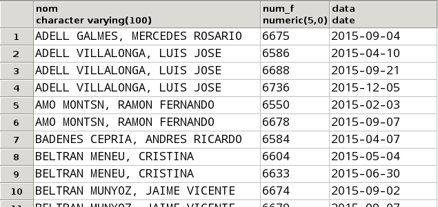

Un total de **105 files**

**6.52** Traure el nom del soci, amb el codi i la descripció de cada
article que ha demanat. Ordena per nom del soci i codi de l'article.

Un total de **541 files**

**6.53** Modificar l'anterior per a que no es repetesquen els resultats.

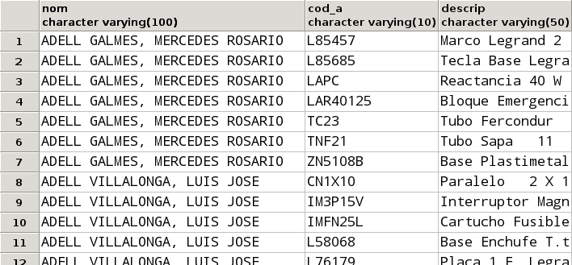

Un total de ****532 files****

Observa com ara no es repeteix la fila 10 i 11, i abans sí

**6.54** Traure el nom dels clients amb la quantitat de factures que
tenen, ordenades per aquest número de major a menor

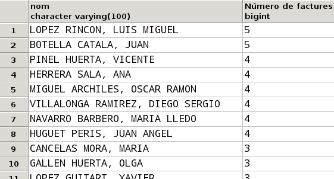

Un total de **40 files**

**6.55** Traure el número de factura, data, codi de client, total de la
factura (amb l'àlies IMPORT) i total de la factura aplicant descomptes
d'article (amb àlies DESCOMPTE_1), com en la consulta**6.33** , però sense el
límit de les 10 línies de factura. Ordena per número de factura.

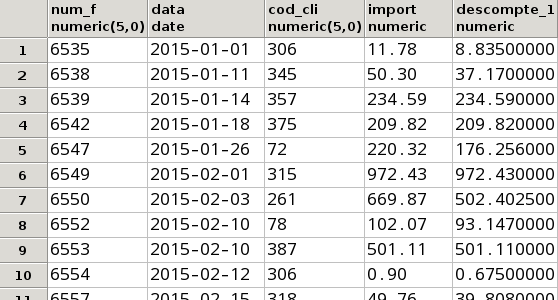

Un total de **105 files**

**6.56** Modificar l'anterior per a aplicar també el descompte de la
factura (amb l'àlies DESCOMPTE_2)

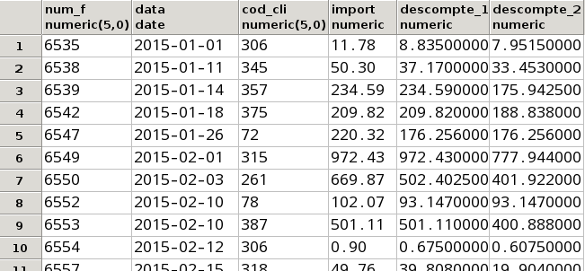

Un total de **105 files**

**6.57** Traure el codi i nom d'aquells venedors que supervisen algú
(consten com a cap). Traure també el número de supervisats de cadascun
d'aquestos supervisors.

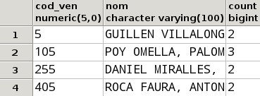

**6.58** Traure el codi i descripció dels articles juntament amb
el número de vegades que s'ha venut, el total d'unitats venudes i la mitjana
d'unitats venudes per factura. Ordenar pel número total d'unitats venudes de
forma descendent, i dins d'aquesta per codi d'article de forma ascendent.

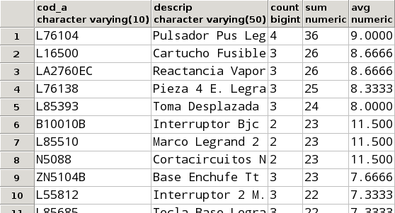

Un total de **399 files**

**6.59** Traure el codi i la descripció de les categories, amb la
quantitat d'articles venuts de cada categoria, d'aquelles categories de les
quals se n'han venut més de 100 unitats. Ordenar per aquest número de forma
descendent.

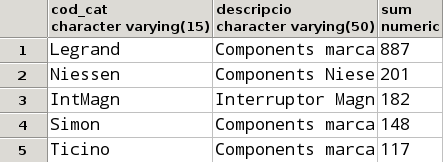

**6.60** Traure el codi i el nom dels clients que no tenen cap factura.

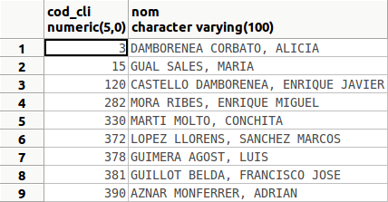

**6.61** Traure el codi, descripció i total d'unitats venudes de tots
els articles, fins i tot d'aquells que no s'ha venut res.

**Nota**

Per a deixar-lo més bonic, com que la suma de valors nuls no és 0 sinó nul,
per a que ens aparegue el valor 0 podem utilitzar la funció COALESCE(_valor_
,0), que si el valor és nul torna un 0.

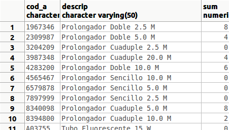

Un total de **812 files**

**6.62** Traure el nom de tots els pobles i el número de clients en
cas que en tinguen. Ordena per número de clients de forma descendent.

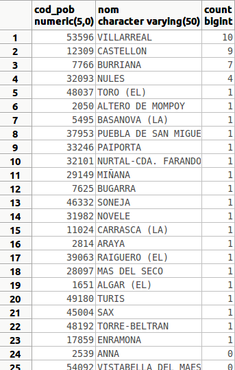

Un total de **1663 files**

**6.63** Traure el codi i la descripció de les categories, amb el
número d'articles de cada categoria i el número total d'unitats venudes de
cada categoria, d'aquelles categories de les quals tenim més de 15 articles, i
ordenat per número d'articles de forma descendent. Aquesta sentència ja és
prou complicada. Concretament haureu de tenir en compte que:

  * Voldrem traure el número d'articles de cada categoria, però potser alguns articles no s'han venut, i per tant no apareixeran en la taula LINIA_FAC.
  * I també tenim el problema que, com ens fa falta la taula LINIA_FAC, un article venut en més d'una factura apareixerà més d'una vegada. Si comptem de forma normal, el comptaríem més d'una vegada cada article. Per tant voldrem comptar els diferents articles de cada categoria.

**6.64** Traure el número màxim de factures fetes a un client

**6.65** Traure el l'import que suposa la factura més cara i l'import que
suposa la més barata (sense considerar ni descomptes ni IVA)

**6.66** Traure el número de factures més alt que s'ha venut per venedor en
cada trimestre (no traurem qui és el venedor, que seria encara més complicat).
Per a poder agrupar per trimestre, ens farà falta la funció
**TO_CHAR****(data,'Q')** , que trau el número de trimestre. El pas previ és
calcular el número de factures de cada venedor i en cada trimestre. Després,
amb la informació anterior, voldrem calcular el màxim de cada trimestre.

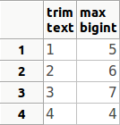

**6.67** Traure els articles més cars que la mitjana. Tragueu-los ordenats per
la categoria, i després per codi d'article.

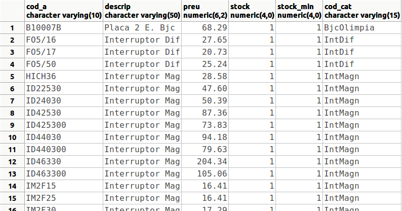

Un total de **164 files**

**6.68** Modificar l'anterior per a traure els articles més cars que la
mitjana de la seua categoria. Tragueu-los ordenats per la categoria

Un total de **75 files**

És un resultat molt similar a l'anterior, però observeu que ara no estan els
productes de les files 5, 14, 15, ...

**6.69** Traure els pobles on tenim clients però no tenim venedors. Ha de ser
per mig de subconsultes (en plural). Ordeneu per codi del poble.

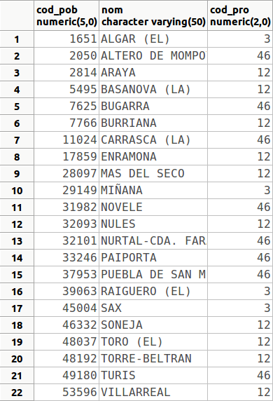

**6.70** Traure els pobles on tenim més venedors que clients. Traure el codi
del poble, el nom i el número de venedors. Ordena per nom del poble.

**6.71** Traure l'import de la factura més cara de cada trimestre. La
informació prèvia és la factura amb la data i l'import. A partir d'ahí haurem
de calcular el màxim de l'import per a cada trimestre (no caldrà traure quina
factura és).

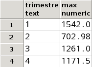

**6.72** Traure el nom del venedor, el número de factures que ha venut i el
percentatge que suposa sobre el total. Podria ser que en el moment de calcular
el percentatge, el número resultant s'haja de convertir a numèric per a que
dóne bé el resultat, ja que en fer una operació amb enters, el resultat serà
enter. Aleshores hauríem d'obligar a que el número tinga decimals
(**::NUMERIC**). I la funció d'arrodonir és **ROUND**. Ordeneu pel nom.

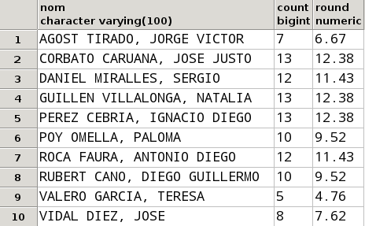

**6.73** Traure tota la informació (amb l'import) de la factura més cara.
Ha de ser per mig de subconsultes. Mireu que segurament hi haurà 2
subconsultes. En la més interna calculem l'import de les factures. En l'altra
calculem el màxim. I en la consulta principal, busquem la factura que
coincideix amb aquest màxim.

**6.74 (voluntari)** Obtenir el venedor que ha venut més unitats de cada
categoria, sense considerar en la categoria el valor nul. Aquesta consulta la
podríem considerar ja com molt avançada.

**6.75** Traure el nom de tots els clients i venedors implicats en alguna
venda del primer trimestre de 2015. Intentar traure en una segona columna el
text **Venedor** per als venedors, i **Client** per als clients. Ordenat pel
nom.

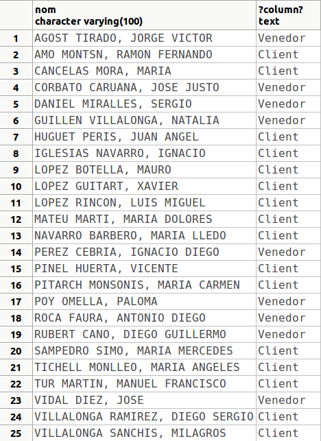

**6.76a** Traure per mig de sentències d'operacions de conjunts els pobles on
tenim algun venedor o algun client. No volem resultats repetits, i ho volem
ordenat pel nom del poble.

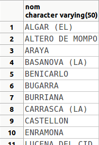

Un total de **31 files**

**6.76b** Modificar l'anterior per a traure els pobles on tenim al mateix
temps venedors i clients

**6.76c** Modificar l'anterior per a traure els pobles on tenim venedors però
no tenim clients

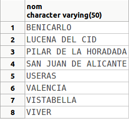

Llicenciat sota la  [Llicència Creative Commons Reconeixement NoComercial
SenseObraDerivada 2.5](http://creativecommons.org/licenses/by-nc-nd/2.5/)

